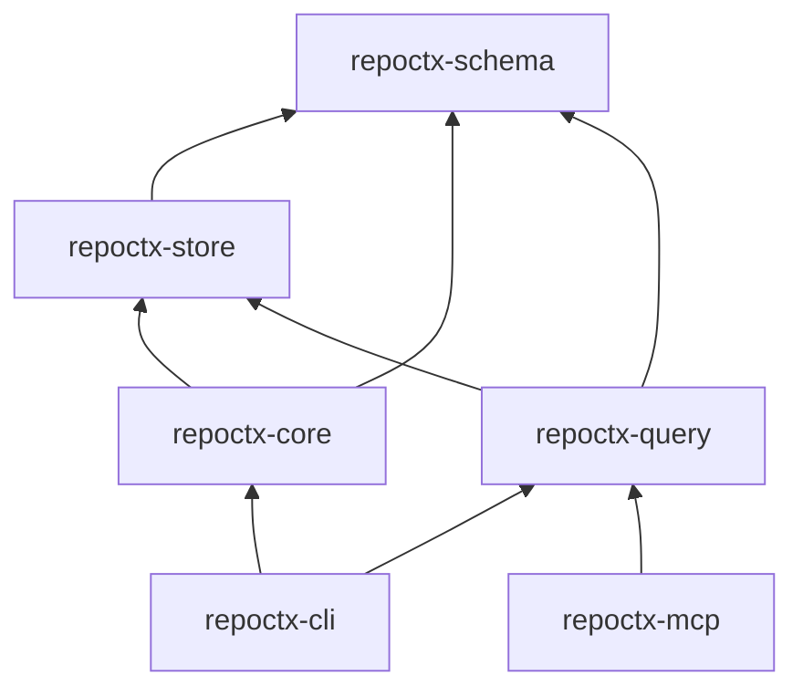

# CODEMAP.md — RepoCtx execution map

> Come scorre l'esecuzione end-to-end. Aggiornare quando si aggiungono route, job o crate.

---

## Binari

| Binario | Crate | Ruolo |
|---|---|---|
| `repoctx` | `repoctx-cli` | CLI developer-facing |
| `repoctx-mcp` | `repoctx-mcp` | MCP stdio via rmcp (`get_context`, `get_impact`, `get_flow`, `get_dependencies`, `get_wiki` planned) |

---

## `repoctx build`

```
repoctx-cli::main
  └─ commands::execute(Build | Workspace)
       └─ repoctx-core::BuildPipeline::run  (single repo)
       └─ repoctx-core::WorkspacePipeline::run  (multi-repo)
            ├─ BuildPipeline per ogni membro
            ├─ CrossRepoLinker (HTTP client ↔ server route)
            └─ ArtifactWriter → .repoctx/cross_repo.json
```

### `repoctx workspace build`

```
repoctx-cli::workspace build
  └─ WorkspacePipeline::run
       ├─ parse repoctx.workspace.toml
       ├─ BuildPipeline × N repos
       ├─ CrossRepoLinker::link
       └─ .repoctx/cross_repo.json
```

---

## `repoctx build` (dettaglio singolo repo)

```
repoctx-cli::main
  └─ commands::execute(Build)
       └─ repoctx-core::BuildPipeline::run
            ├─ FileWalker::discover          # ignore + .repoctxignore
            ├─ TreeSitterParser::parse_file  # tree-sitter (Rust, Py, TS, JS, Go, Java)
            ├─ IndexStore::delete_symbols_for_path  # incremental purge
            ├─ IndexStore::insert_symbol
            ├─ GraphResolver::resolve_calls  # call edges → DB
            ├─ FlowReconstructor::reconstruct # flows.json
            ├─ index_entrypoints (main)      # entrypoints.json
            ├─ IndexStore::export_artifacts
            └─ ArtifactWriter::write_artifact × 5
                 → .repoctx/symbols.json
                 → .repoctx/dependencies.json
                 → .repoctx/flows.json
                 → .repoctx/entrypoints.json
                 → .repoctx/architecture.json
                 + .repoctx/index.db (cache)
```

---

## Query commands (`impact` | `flow` | `context`)

```
repoctx-cli::commands::execute
  └─ repoctx-query::QueryEngine
       ├─ IndexStore::open (.repoctx/index.db)
       ├─ find_symbols_by_name / find_flow_by_name
       └─ downstream_symbols (recursive CTE)
```

## Adoption path (v0.1 → v0.2)

| Today (v0.1) | v0.2 (planned) |
|---|---|
| `QueryEngine::context` — metadata JSON | `ContextAssembler::assemble` — markdown bundle + snippets |
| MCP `get_impact`, `get_flow`, `get_dependencies` | MCP `get_wiki`, full `get_context` bundle |
| `build --watch` incremental | watch → wiki stale queue |

North star: `repoctx context X --format md --task fix` → one file for the agent (ADR-0006).

---

### `repoctx context` (v0.2 — Context Assembly; metadata today)

```
repoctx-cli::context
  └─ repoctx-query::ContextAssembler::assemble(symbol, budget)
       ├─ resolve symbol → graph node
       ├─ neighborhood (callers/callees BFS) + impact set
       ├─ rank by edge proximity + embedding similarity
       ├─ slice source snippets from disk (path + line ranges)
       ├─ attach grounded wiki page(s) from .repoctx/wiki/
       └─ greedy pack to token budget → ContextBundle JSON
```

### `repoctx wiki` (planned — Knowledge Layer)

```
repoctx-cli::wiki {sync|lint|show}
  ├─ sync → WikiCompiler::sync_area (MCP sampling, grounded subgraph prompt)
  │         └─ write .repoctx/wiki/*.md + update graph_fingerprint
  ├─ lint → WikiLinter::run (deterministic: stale, broken links, edge claims)
  └─ show  → load page by symbol id or page name
```

---

## MCP (`repoctx-mcp`)

```
repoctx-mcp::main (tokio)
  └─ server::serve(stdio)
       └─ RepoCtxMcpServer (rmcp tool_router)
            ├─ get_context  → ContextAssembler::assemble (planned) / QueryEngine::context (today)
            ├─ get_wiki     → WikiStore::load_page (planned)
            ├─ get_impact   → QueryEngine::impact
            ├─ get_flow     → QueryEngine::flow
            └─ get_dependencies → QueryEngine::dependencies
```

Env: `REPOCTX_ROOT` = percorso repo (default: cwd). Richiede `repoctx build` eseguito prima.

---

## Dipendenze tra crate



---

## File system output

```
<repo-root>/
  .repoctx/
    index.db          # SQLite cache (rebuildable)
    architecture.json
    symbols.json
    dependencies.json
    flows.json
    entrypoints.json
    wiki/             # (planned) grounded knowledge pages
      index.md
      *.md

<workspace-root>/
  repoctx.workspace.toml
  .repoctx/
    cross_repo.json     # workspace-level cross-repo edges
```
