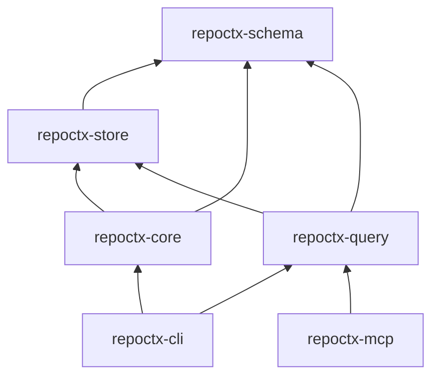

# CODEMAP.md — RepoCtx execution map

> Come scorre l'esecuzione end-to-end. Aggiornare quando si aggiungono route, job o crate.

---

## Binari

| Binario | Crate | Ruolo |
|---|---|---|
| `repoctx` | `repoctx-cli` | CLI developer-facing |
| `repoctx-mcp` | `repoctx-mcp` | MCP stdio (stub v0) |

---

## `repoctx build`

```
repoctx-cli::main
  └─ commands::execute(Build)
       └─ repoctx-core::BuildPipeline::run
            ├─ FileWalker::discover          # ignore + .repoctxignore
            ├─ IndexStore::open / file_hash  # incremental skip
            ├─ HeuristicExtractor::extract   # per-file symbols (→ tree-sitter)
            ├─ IndexStore::insert_symbol
            ├─ IndexStore::export_artifacts
            └─ ArtifactWriter::write_artifact × 5
                 → .repoctx/symbols.json
                 → .repoctx/dependencies.json
                 → .repoctx/flows.json
                 → .repoctx/entrypoints.json
                 → .repoctx/architecture.json
                 + .repoctx/index.db (cache)
```

---

## Query commands (`impact` | `flow` | `context`)

```
repoctx-cli::commands::execute
  └─ repoctx-query::QueryEngine
       ├─ IndexStore::open (.repoctx/index.db)
       ├─ find_symbols_by_name / find_flow_by_name
       └─ downstream_symbols (recursive CTE)
```

---

## Dipendenze tra crate



---

## File system output

```
<repo-root>/
  .repoctx/
    index.db          # SQLite cache (rebuildable)
    architecture.json
    symbols.json
    dependencies.json
    flows.json
    entrypoints.json
```
