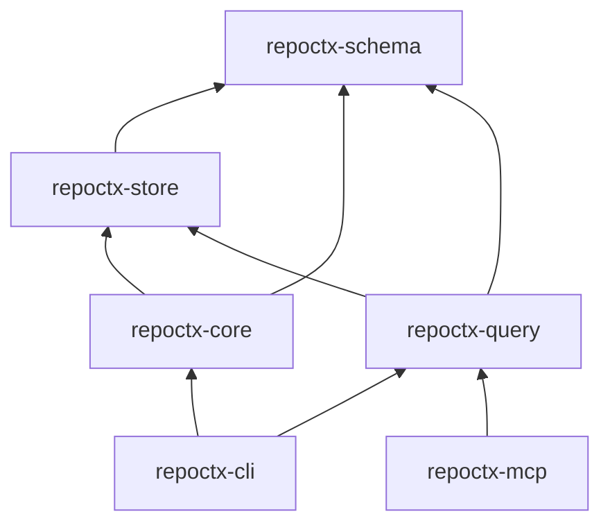

# CODEMAP.md — RepoCtx execution map

> Come scorre l'esecuzione end-to-end. Aggiornare quando si aggiungono route, job o crate.

---

## Binari

| Binario | Crate | Ruolo |
|---|---|---|
| `repoctx` | `repoctx-cli` | CLI developer-facing |
| `repoctx-mcp` | `repoctx-mcp` | MCP stdio via rmcp (`get_context`, `get_impact`, `get_flow`, `get_dependencies`) |

---

## `repoctx build`

```
repoctx-cli::main
  └─ commands::execute(Build)
       └─ repoctx-core::BuildPipeline::run
            ├─ FileWalker::discover          # ignore + .repoctxignore
            ├─ TreeSitterParser::parse_file  # tree-sitter (Rust, Py, TS, JS, Go, Java)
            ├─ IndexStore::delete_symbols_for_path  # incremental purge
            ├─ IndexStore::insert_symbol
            ├─ GraphResolver::resolve_calls  # call edges → DB
            ├─ FlowReconstructor::reconstruct # flows.json
            ├─ index_entrypoints (main)      # entrypoints.json
            ├─ IndexStore::export_artifacts
            └─ ArtifactWriter::write_artifact × 5
                 → .repoctx/symbols.json
                 → .repoctx/dependencies.json
                 → .repoctx/flows.json
                 → .repoctx/entrypoints.json
                 → .repoctx/architecture.json
                 + .repoctx/index.db (cache)
```

---

## Query commands (`impact` | `flow` | `context`)

```
repoctx-cli::commands::execute
  └─ repoctx-query::QueryEngine
       ├─ IndexStore::open (.repoctx/index.db)
       ├─ find_symbols_by_name / find_flow_by_name
       └─ downstream_symbols (recursive CTE)
```

---

## MCP (`repoctx-mcp`)

```
repoctx-mcp::main (tokio)
  └─ server::serve(stdio)
       └─ RepoCtxMcpServer (rmcp tool_router)
            ├─ get_context  → QueryEngine::context
            ├─ get_impact   → QueryEngine::impact
            ├─ get_flow     → QueryEngine::flow
            └─ get_dependencies → QueryEngine::dependencies
```

Env: `REPOCTX_ROOT` = percorso repo (default: cwd). Richiede `repoctx build` eseguito prima.

---

## Dipendenze tra crate



---

## File system output

```
<repo-root>/
  .repoctx/
    index.db          # SQLite cache (rebuildable)
    architecture.json
    symbols.json
    dependencies.json
    flows.json
    entrypoints.json
```
